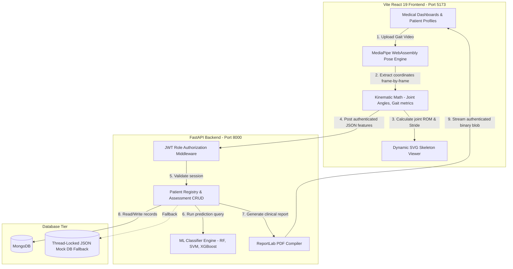

# 🏥 RehabShield: ML-Based Stroke Rehabilitation Decision Support System

[](https://react.dev/)
[](https://fastapi.tiangolo.com/)
[](https://www.typescriptlang.org/)
[](https://tailwindcss.com/)
[](https://mediapipe.dev/)
[](https://scikit-learn.org/)
[](https://www.docker.com/)

An AI-assisted **Stroke Rehabilitation Clinical Decision Support System (CDSS)** developed for quantitative motor impairment evaluation. The platform helps physiotherapists and neurologists objectively monitor gait symmetry, joint range of motion (ROM), and upper-limb spasticity using computer vision and machine learning.

> **Clinical Disclaimer**: *RehabShield is an objective decision-support tool designed to assist clinicians. Final diagnostic, pharmacological, and treatment decisions must always be made by qualified healthcare professionals.*

---

## 🌟 Key Features

* **🎥 Hardware-Accelerated Pose Estimation (MediaPipe WebAssembly)**:
  * Client-side WebGL pose tracker detecting 33 spatial anatomical landmarks.
  * Completely offline-enabled without external CDN dependencies.
* **📐 Biomechanical Kinematics Engine**:
  * Real-time extraction of Knee Flexion, Hip Extension, Shoulder Elevation, and Elbow Spasticity angles.
  * Calculation of Cadence (steps/min), Stride Length (m), Walking Speed (m/s), Step Symmetry Ratio, and Lateral Trunk Sway (Balance Stability %).
* **🤖 Multi-Model Machine Learning Impairment Classifier**:
  * Evaluates motor recovery into clinical severity tiers: *Normal, Mild, Moderate, Severe, Very Severe*.
  * Supports ensemble **Random Forest**, **Support Vector Machines (SVM)**, and **Gradient Boosting (XGBoost fallback)** with feature importance weight visualization.
* **💊 Intelligent Exercise Prescription & Home Program**:
  * Translates measured kinematic deficits directly into targeted exercise protocols with specific dosages, intensity levels, and clinical rationales.
* **📊 Longitudinal Progress & Trend Analytics**:
  * Interactive Recharts area and multi-series curves tracking motor recovery across multi-month clinical sessions.
* **📑 ReportLab Vector PDF Clinical Reporting**:
  * One-click generation of comprehensive clinical diagnostic reports with standardized scales (Fugl-Meyer, Berg Balance, TUG), demographic data, and clinician signature blocks.
* **🔐 Role-Based Access Control (RBAC)**:
  * Distinct authorization profiles for **Physiotherapists**, **Consulting Doctors / Neurologists**, and **System Administrators**.

---

## 🏗️ System Architecture



---

## 🚀 Quick Start (Local Setup)

### Prerequisites
* **Python 3.10+** (Python 3.11/3.12/3.14 supported)
* **Node.js 18+** & `npm`

### 1. Clone the Repository
```bash
git clone https://github.com/SumitKSinghDev/Stroke-Rehabilitation-Analysis-System.git
cd Stroke-Rehabilitation-Analysis-System
```

### 2. Backend Setup
```bash
# Install Python dependencies
pip install -r requirements.txt

# Start FastAPI backend server
python -m uvicorn backend.main:app --host 127.0.0.1 --port 8000
```
Backend Swagger API documentation will be live at: `http://localhost:8000/docs`

### 3. Frontend Setup
```bash
cd frontend

# Install Node dependencies
npm install

# Start Vite React development server
npm run dev
```
Open your browser at: `http://localhost:5173`

---

## 🔑 Default Clinician Credentials

| Role | Username | Password | Purpose |
| :--- | :--- | :--- | :--- |
| **Head Physiotherapist** | `therapist` | `therapist123` | Conducts video scans, reviews joint ROM, prescribes exercises |
| **Consulting Doctor** | `doctor` | `doctor123` | Validates clinical scales (FMA/BBS), downloads signed PDF reports |
| **System Administrator** | `admin` | `admin123` | Manages hospital accounts, audit logs, and diagnostic health |

*(Quick 1-click login buttons are also provided directly on the login screen for easy viva demonstration).*

---

## 🐳 Docker Deployment

To build and run the entire application containerized:
```bash
docker-compose up --build
```
Access the application at `http://localhost:8000`.

---

## 🛠️ Tech Stack Overview

* **Frontend**: React 19, TypeScript, Tailwind CSS, Lucide React, Framer Motion, Recharts, Vite.
* **Backend**: FastAPI, Pydantic v2, Scikit-learn, ReportLab, OpenCV, NumPy, Bcrypt, Python-Jose.
* **Computer Vision**: MediaPipe Pose (WebAssembly / WebGL client execution).
* **Storage**: MongoDB with automatic thread-locked JSON local fallback.

---

## 📄 License
This project is licensed under the MIT License - see the [LICENSE](LICENSE) file for details.
